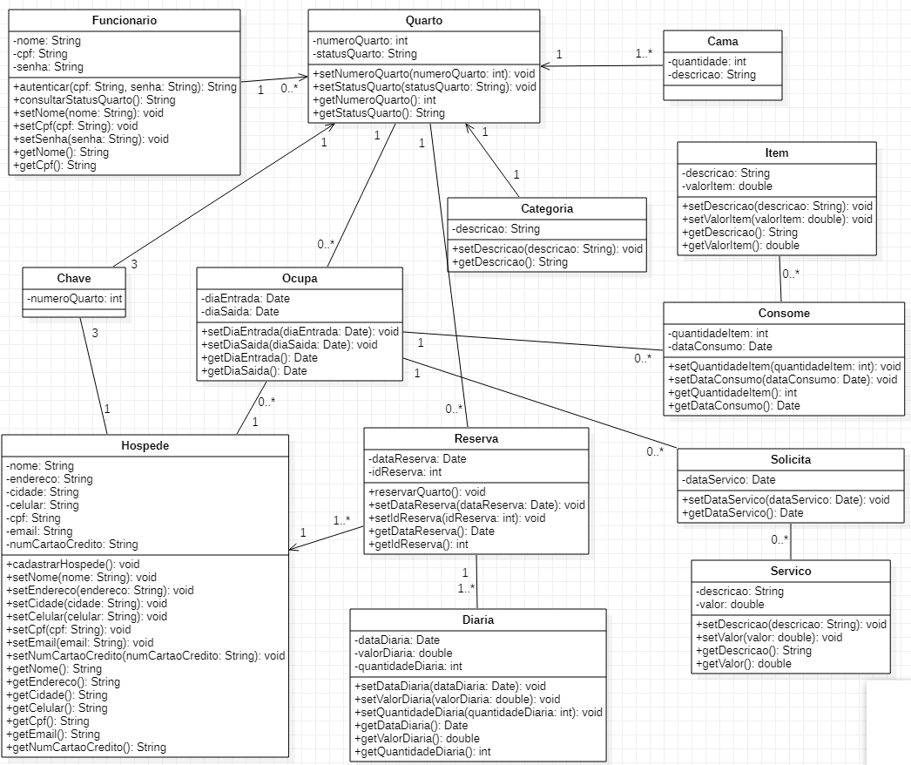

# diagrama-classes-controle-hoteis

### Descrição do Desafio

Um cliente contratou a empresa que você trabalha para desenvolver um sistema de controle de hotéis. 

Você foi incumbido de fazer o diagrama de classes após o texto que o cliente enviou, transcrito abaixo:

“No meu sistema teremos obviamente os recepcionistas, que irão poder acessar o sistema com seu CPF e senha. 

Os recepcionistas poderão consultar os quartos, verificando quais estão vagos, quais estão ocupados e quais estão reservados. 

Poderá ser emitido também até três chaves aos hospedes. 

O cliente poderá fazer a reserva de um quarto, mas antes terá que ser feito seu cadastro com suas informações pessoais, incluindo o endereço. 

Ao se hospedar em um quarto, o cliente terá as despesas de serviço de quarto, incluindo despesas de frigobar, que ficarão vinculadas a todos os hospedes de um quarto.

Todo quarto possui também uma categoria, podendo ser de luxo, suíte master ou quarto simples. 

Além da categoria, os quartos tem também a quantidade de camas, podendo ser de casal e solteiro".

#### Interprete o texto acima de seu cliente e modele o diagrama de classes. Se necessário, explique em texto o porquê de suas escolhas. 

